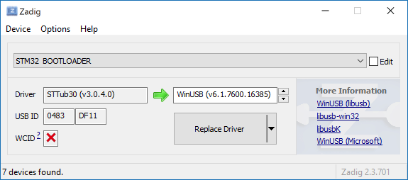
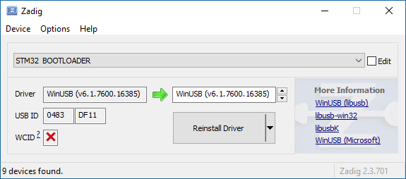
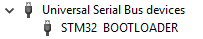

# Netduino Bootloader WinUSB Driver Install Guide 
March 20, 2018

This guide will show you how to replace your existing Netduino bootloader driver with WinUSB using the free USB driver installation tool Zadig.

This is required to allow NetduinoDeploy to read and write values to your Netduino board(s) including network settings and firmware.

The steps in this guide were tested on Windows 10 64-bit but should work on Windows 7, 8 & 8.1.

## Steps
1. Download Zadig http://zadig.akeo.ie/ (latest version is 2.3 at the time of writing)
2. Launch Zagig
3. Connect your Netduino in [**DFU Bootloader Mode**](http://developer.wildernesslabs.co/Netduino/About/Updating_Firmware/)
4. In Zadig, Open the Options menu and check **List all Devices**
5. Find **STM32 BOOTLOADER** in the dropdown list

   

6. Click **Replace Driver** 

   

7. Verify that WinUSB is listed as both the current and target driver

## Notes
All current Netduino boards will use the same bootloader driver. The driver update will affect any Netduino connected to your PC.

This only replaces the bootloader driver. The MFUSB_Netduino.sys driver provided by the installer will still be used when the Netduino is in "normal" or "development" mode.

Major Windows 10 updates may update/replace the driver assigned to the Netduion bootloader. If you're unable to connect to your Netduino in bootloader mode, repeat the steps above.

### To restore the original bootloader driver
1. Connect your device bootloader mode
2. Open the Device Manager
3. Uninstall the driver for STM32 BOOTLOADER

   

4. Re-install the Netduino SDK from the Wilderness Labs website
