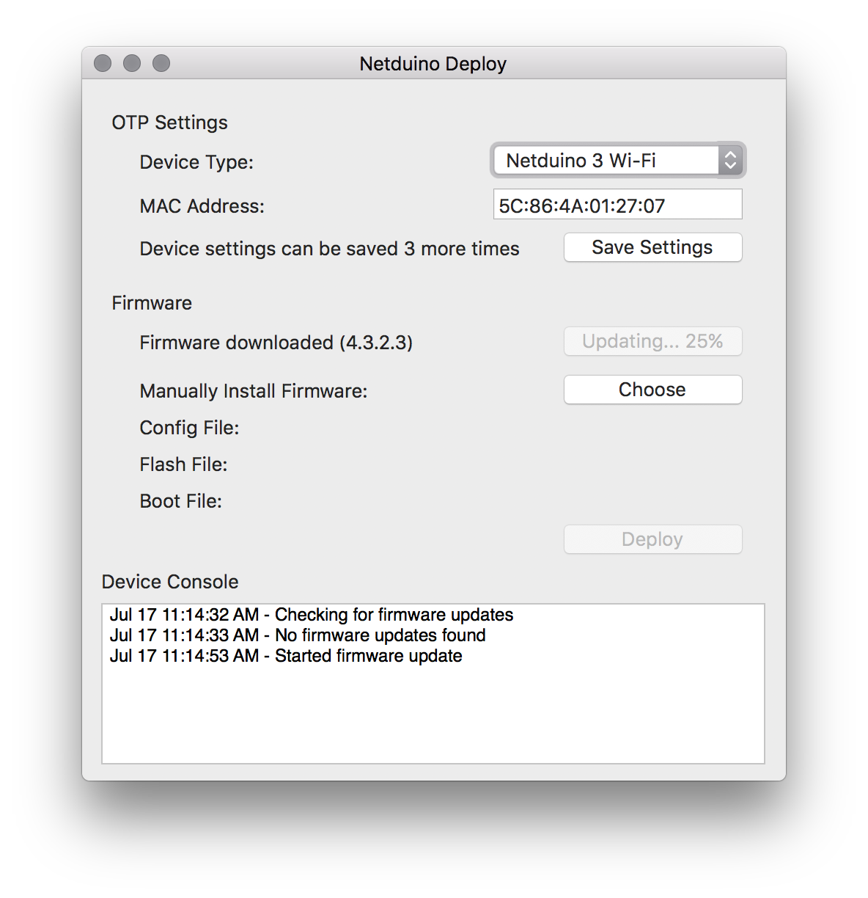
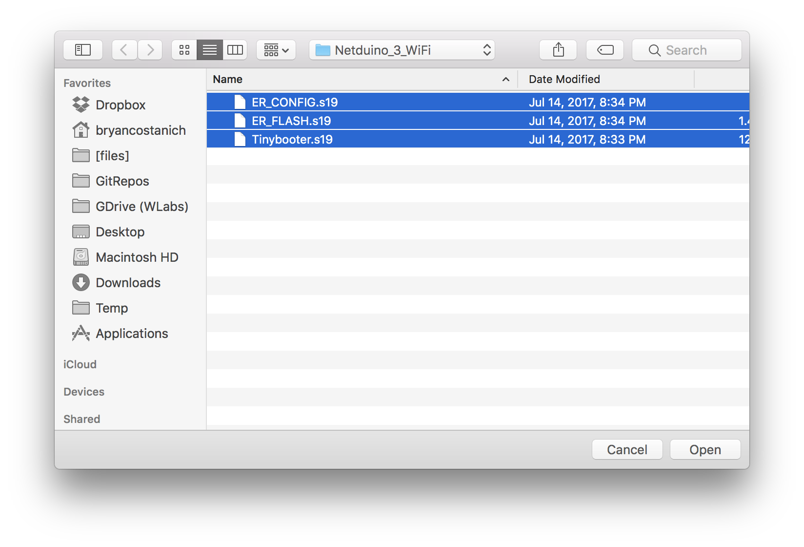
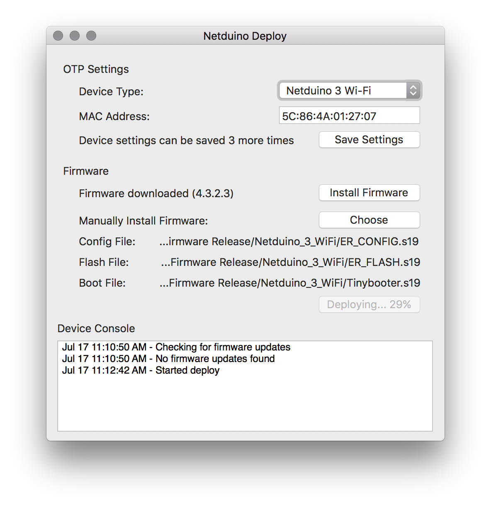

# Netduino Updater

This repo contains the source code to both the [Windows](NetduinoUpdate) and [Mac](NetduinoUtils) Netduino firmware deployment utilities.

## Required OS's
* Mac OS Sierra+
* Windows 8+

## Overview

Both the Windows and Mac firmware deployment utilties use the low-level DFU protocol, rather than MFUsb/MFDeploy protocols, to update firmware. This has the advantage of being able to deploy to devices that do not have .NETMF Tinybooter on them. This means that a device that has never been programmed, or has been bricked from a faulty firmware deployment can still be updated.

## Code

The [Mac](NetduinoUtils) code is newer than the [Windows](NetduinoUpdate) code and has been built with our cross-platform [DFU-Sharp](https://github.com/WildernessLabs/DFU-Sharp) library code. As such, the Mac app should be considered canonical, whereas the Windows app will be replaced in the future with cross-platform code.

# Netduino MacDeploy Tool (Mac)

A simple application to automatically deploy latest official firmware, or manually deploy test firmware:

## Current Pre-Release

* [v0.1.0pre](https://github.com/WildernessLabs/Netduino-Updater/releases/tag/v0.1.0pre)

### Known Issues

 * UX is not finished.
 * Does not detect device connect/disconnect.
 * Unprogrammed N3WiFi in DFU mode doesn't allow window to be viewable/launch.
 * Cannot configure network yet.

## Uploading Firmware to Device

### On Mac using the MacDeploy Tool

#### Automatic Installation of Latest Official Firmware

 1. Open the latest MacDeploy tool.
 2. Click the `Install Firmware` button, firmware should install:
 
 

#### Manual Installation of Firmware from .hex or .s19 files

 1. Open the latest MacDeploy tool.
 2. Click the `Choose` button, and select either the `.hex` or `.s19` `Tinybooter`, `ER_CONFIG`, and `ER_FLASH` files:
 
 3. Click `Deploy` and it should deploy the firmware:
 
 
# Windows

[Content coming soon]